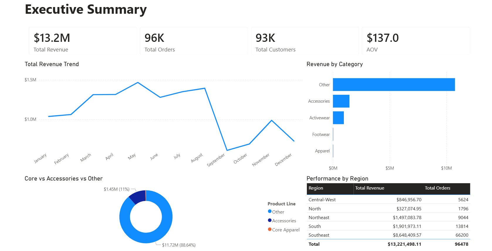
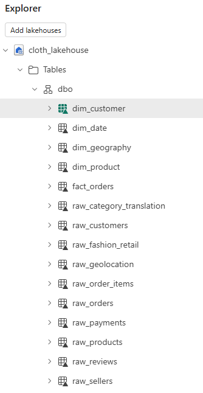
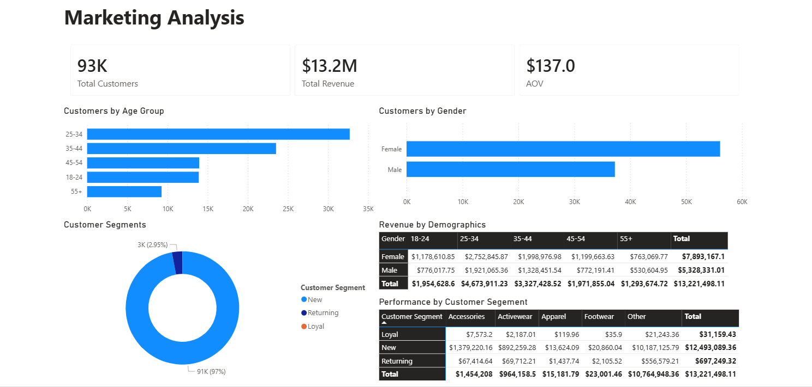
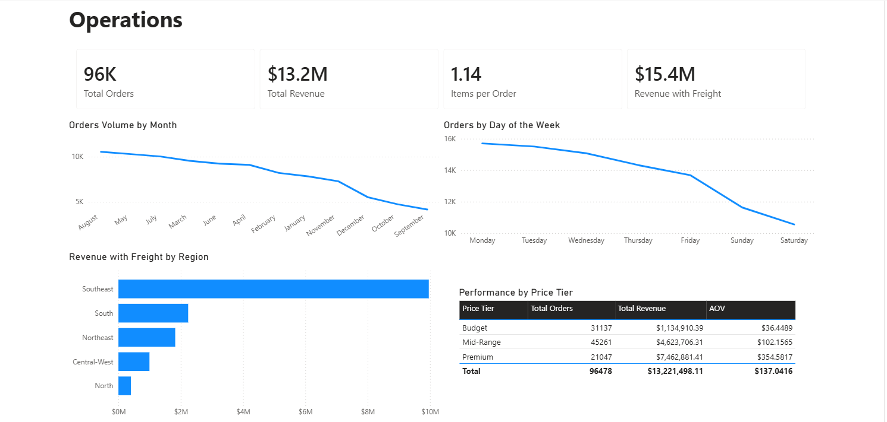

# Cloth Retail Analytics Platform

An end-to-end data platform built in Microsoft Fabric to support a streetwear brand's accessories re-brand strategy. This project demonstrates data engineering, dimensional modeling, and solutions architecture thinking.



---

## Business Context

**Cloth** is an online streetwear brand whose accessories line underperforms industry benchmarks (12% of revenue vs. 25-30% typical). Leadership is planning a Q2 re-brand and needs analytics to answer:

- Which customer segments are already buying accessories?
- How do accessories buyers differ from apparel-only customers?
- What pricing and regional strategies should inform the re-brand?

This platform consolidates customer, order, and product data into a unified view serving three stakeholders: CEO, Marketing Director, and COO.

---

## Architecture

```
┌─────────────────────────────────────────────────────────────────────────┐
│                           DATA SOURCES                                  │
│                    Olist E-commerce Dataset (Kaggle)                    │
└───────────────────────────────┬─────────────────────────────────────────┘
                                │
                                ▼
┌─────────────────────────────────────────────────────────────────────────┐
│                         BRONZE LAYER (Raw)                              │
│   raw_customers │ raw_orders │ raw_order_items │ raw_products │ ...     │
└───────────────────────────────┬─────────────────────────────────────────┘
                                │
                                ▼
┌─────────────────────────────────────────────────────────────────────────┐
│                         GOLD LAYER (Dimensional Model)                  │
│                                                                         │
│                           ┌──────────┐                                  │
│                           │ dim_date │                                  │
│                           └────┬─────┘                                  │
│                                │                                        │
│    ┌──────────────┐     ┌──────┴───────┐     ┌─────────────┐            │
│    │ dim_customer │─────│ fact_orders  │─────│ dim_product │            │
│    └──────────────┘     └──────┬───────┘     └─────────────┘            │
│                                │                                        │
│                         ┌──────┴───────┐                                │
│                         │dim_geography │                                │
│                         └──────────────┘                                │
│                                                                         │
└───────────────────────────────┬─────────────────────────────────────────┘
                                │
                                ▼
┌─────────────────────────────────────────────────────────────────────────┐
│                         SEMANTIC LAYER                                  │
│              Power BI Semantic Model + DAX Measures                     │
└───────────────────────────────┬─────────────────────────────────────────┘
                                │
                                ▼
┌─────────────────────────────────────────────────────────────────────────┐
│                         PRESENTATION LAYER                              │
│         Executive Summary │ Marketing Analysis │ Operations             │
└─────────────────────────────────────────────────────────────────────────┘
```

---

## Tech Stack

| Layer | Technology |
|-------|------------|
| Platform | Microsoft Fabric |
| Storage | Fabric Lakehouse (OneLake) |
| Transformation | PySpark Notebooks |
| Modeling | Star Schema (Dimensional) |
| Semantic | Power BI Semantic Model |
| Visualization | Power BI Reports |

---

## Data Model

| Table | Rows | Description |
|-------|------|-------------|
| dim_date | 774 | Date dimension with day/week/month/quarter/year attributes |
| dim_customer | 93,358 | Customer dimension with demographics and segmentation |
| dim_product | 32,951 | Product dimension with category mapping and price tiers |
| dim_geography | 4,310 | Geographic dimension with region groupings |
| fact_orders | 110,197 | Order line items with revenue and quantity measures |



---

## Dashboards

### Executive Summary
High-level KPIs for CEO: revenue trends, category performance, regional breakdown.


### Marketing Analysis
Customer segmentation for Marketing Director: demographics, segments, category performance by customer type.



### Operations
Operational metrics for COO: order volume patterns, day-of-week trends, fulfillment by region.



---

## Key Insights

From the dashboards, Cloth leadership can see:

- **Accessories = 11% of revenue ($1.45M)** — confirms underperformance vs. industry benchmark
- **25-34 age group is largest segment** — primary target for re-brand campaign  
- **Southeast region dominates** (65% of revenue) — geographic expansion opportunity exists
- **97% of customers are "New"** — retention/loyalty is a challenge across all categories
- **Premium tier drives 56% of revenue** despite fewer orders — price tolerance exists

---

## Project Documentation

| Document | Description |
|----------|-------------|
| [Business Context](docs/01-business-context.md) | Stakeholder requirements and success criteria |
| [Data Source Evaluation](docs/02-data-source-evaluation.md) | Assessment of candidate datasets |
| [Architecture Design](docs/03-architecture-design.md) | Dimensional model and technical decisions |
| [Vendor Evaluation](docs/04-vendor-evaluation.md) | Platform comparison and recommendation |

---

## What This Project Demonstrates

**Data Engineering**
- End-to-end pipeline from raw CSV to analytical model
- Medallion architecture (Bronze → Gold)
- PySpark transformations in Fabric notebooks

**Data Architecture**
- Dimensional modeling (star schema)
- Source-to-target mapping
- Data quality handling

**Solutions Architecture**
- Business requirements gathering
- Platform evaluation with cost analysis
- Trade-off documentation and decision records

---

## About

This project was built to demonstrate end-to-end data platform development with a solutions architecture mindset. The focus is not just on technical implementation, but on business context, architectural decisions, and stakeholder-oriented deliverables.

---

## Data Source

[Brazilian E-Commerce Public Dataset by Olist](https://www.kaggle.com/datasets/olistbr/brazilian-ecommerce) — 100K orders from 2016-2018, used under CC BY-NC-SA 4.0 license.
